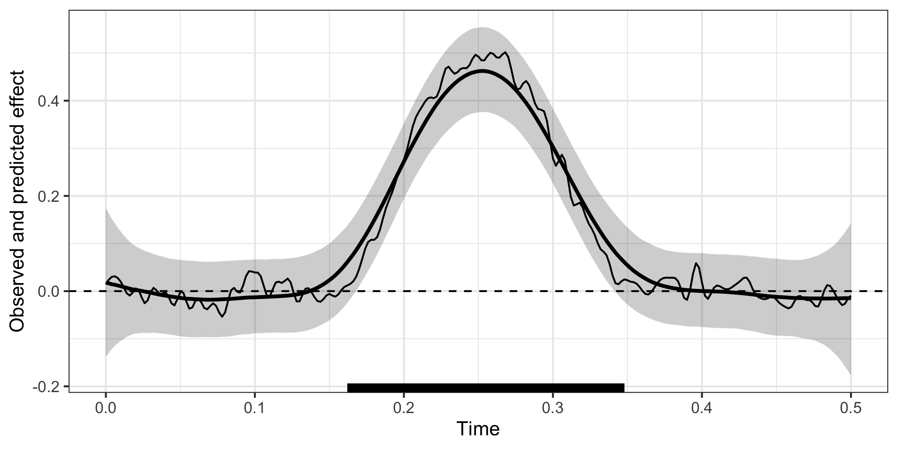
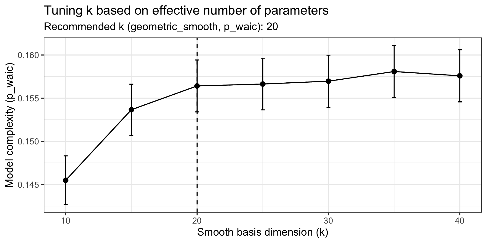

# Modelling time-resolved electrophysiological data with Bayesian generalised additive multilevel models <a href="https://lnalborczyk.github.io/neurogam/"></a>

<!-- badges: start -->

[](http://www.repostatus.org/#wip)
[](https://github.com/lnalborczyk/neurogam)
[](https://github.com/lnalborczyk/neurogam)
<!-- badges: end -->

The goal of `neurogam` is to provide utilities for estimating the onset
and offset of time-resolved effects, such as those found in M/EEG,
pupillometry, or finger/mouse-tracking data (amongst others). The
current version only allows fitting 1D temporal data (e.g., raw M/EEG
data or decoding timecourses, pupillometry) but will be extended in the
near future to support 2D temporal and 3D spatiotemporal data.

## Installation

You can install the development version of `neurogam` from GitHub with:

``` r
install.packages("remotes")

remotes::install_github(
    repo = "https://github.com/lnalborczyk/neurogam",
    dependencies = TRUE
    )
```

## Usage

### Model fitting

Below we fit a Bayesian generalised additive multilevel model (BGAMM)
with varying intercept, slope, and smooth (per participant) to estimate
the onset and offset of a difference between conditions. Note that we
recommend fitting the BGAMM on time-resolved summary statistics (mean
and SD) as the full (i.e., trial-by-trial) BGAMM may be too slow, and
the group-level BGAM (i.e., no random/varying effect) may provide
anticonservative cluster estimates.

``` r
# loading the neurogam package
library(neurogam)

# importing some simulated EEG data
data(eeg_data)

# displaying some rows
head(eeg_data)
#>      participant condition trial  time       eeg
#> 1 participant_01     cond1     1 0.000 0.8618045
#> 2 participant_01     cond1     1 0.002 1.2729148
#> 3 participant_01     cond1     1 0.004 1.6538158
#> 4 participant_01     cond1     1 0.006 1.3910888
#> 5 participant_01     cond1     1 0.008 0.6499553
#> 6 participant_01     cond1     1 0.010 0.1548358
```

``` r
# fitting the BGAMM to identify clusters (around 10 minutes on a recent laptop)
results <- testing_through_time(
    # simulated EEG data
    data = eeg_data,
    # name of predictor in data
    # predictor_id = "condition",
    # when predictor_id = NA, tests average level against 0
    predictor_id = NA,
    # we recommend fitting the GAMM with summary statistics (mean and SD)
    multilevel = "summary",
    # threshold on posterior odds
    threshold = 10,
    # number of iterations (per MCMC)
    iter = 5000
    )
```

The `testing_through_time()` function returns an object of class
`clusters_results`, which is a list containing:

- clusters: a data frame with one row per detected cluster;
- predictions: a data frame with time-resolved posterior summaries;
- data: data used to fit the model (possibly summarised);
- model: the fitted model object;
- multilevel: the value of the argument.

``` r
# results structure
str(results)

# model formula
results$model$formula
```

### Visualising the results

``` r
# displaying the identified clusters
print(results)
#> 
#> ==== Time-resolved GAMM results ===============================
#> 
#> Clusters found: 
#> 
#>      sign id onset offset duration
#>  positive  1 0.162  0.348    0.186
#> 
#> =================================================================
```

``` r
# plotting the data, model's predictions, and clusters
plot(results)
```



### Posterior predictive checks

We recommend visually assessing the predictions of the model against the
observed data. We provide a lightweight `ppc()` method, but you can
conduct various PPCs with `brms::pp_check(results$model, ...)` (for all
available PPCs, see
<https://mc-stan.org/bayesplot/reference/PPC-overview.html>).

``` r
# posterior predictive checks (PPCs)
ppc(object = results, ppc_type = "participant")
```


### How to define the basis dimension?

We cannot provide a single universal recommendation for choosing the
optimal value of $k$, as it depends on several factors, including the
sampling rate, preprocessing steps (e.g., signal-to-noise ratio,
low-pass filtering), and the underlying temporal dynamics of the effect
of interest. One strategy is to set $k$ as high as computational
constraints allow (acknowledging that the $k$-value only provides an
upper bound on the *effective* basis dimension). Alternatively, one can
fit a series of models with different $k$ values and compare these
models using information criteria such as LOOIC or WAIC, alongside with
posterior predictive checks (PPCs), to select the model that best
captures the structure of the data. We illustrate this approach below.

``` r
# recommend an optimal smooth basis dimension k
k_res <- recommend_k(
    object = results,
    k_min = 10,
    k_max = 40,
    k_step = 5,
    criterion = "waic"
    )
```



``` r
# results summary
summary(k_res)
#> 
#> ==== Summary of k recommendation ===================================
#> 
#> Number of models fitted  : 7
#> k values tested          : 10, 15, 20, 25, 30, 35, 40
#> Range of k values        : [10, 40]
#> Knee based on            : p_waic
#> Recommended k (knee)     : 15
#> 
#> Comparison table (rounded):
#> 
#>   k   model waic_elpd waic_elpd_se p_waic p_waic_se     waic p_waic_smooth
#>  10 gam_k10 -4703.617        5.394  0.145     0.003 9407.234         0.145
#>  15 gam_k15 -4703.966        5.395  0.155     0.003 9407.932         0.155
#>  20 gam_k20 -4704.013        5.395  0.156     0.003 9408.026         0.156
#>  30 gam_k30 -4704.064        5.395  0.156     0.003 9408.128         0.156
#>  25 gam_k25 -4704.094        5.395  0.157     0.003 9408.189         0.157
#>  35 gam_k35 -4704.104        5.395  0.157     0.003 9408.207         0.157
#>  40 gam_k40 -4704.159        5.395  0.159     0.003 9408.319         0.159
#> 
#> ====================================================================
```

## Polyglot use of `neurogam`

To use `neurogam` functions in Python (e.g., on MNE epochs), we
recommend using the `rpy2` interface (<https://github.com/rpy2/rpy2>),
as shown below. It simply requires reshaping MNE epochs into long format
(one trial/observation per row) (see for instance
`epochs.to_data_frame(long_format=True)`,
<https://mne.tools/stable/generated/mne.Epochs.html#mne.Epochs.to_data_frame>).

``` python
# loading the Python modules
import rpy2.robjects as robjects
from rpy2.robjects.packages import importr
from rpy2.robjects.conversion import localconverter

# importing the "neurogam" R package
neurogam = importr("neurogam")

# reshaping epochs into long format
# long_df = epochs.to_data_frame(long_format=True)

# assuming long_df is some M/EEG data reshaped in long format
with localconverter(robjects.default_converter + pandas2ri.converter):
    
    long_df_r = robjects.conversion.py2rpy(long_df)
    

# using the testing_through_time() function from the neurogam package
results = neurogam.testing_through_time(data=long_df_r, threshold=10)
```

To use `neurogam` functions in Julia, we recommend using the `RCall`
package (<https://juliainterop.github.io/RCall.jl/stable/>) (thanks to
Benedikt Ehinger for sharing this code snippet).

``` r
# loading the RCall module
using RCall

# importing the neurogam R package
@rimport neurogam

# assuming long_df is some M/EEG data reshaped in long format
results = neurogam.testing_through_time(data=long_df, threshold=10)
```

## Citation

When using `neurogam`, please cite the following publication:

- Nalborczyk, L., & Bürkner, P. (2025). Precise temporal localisation of
  M/EEG effects with Bayesian generalised additive multilevel models.
  *biorXiv*. Preprint available at:
  <https://doi.org/10.1101/2025.08.29.672336>.

As `neurogam` is an interface to the `brms` package, please additionally
cite one or more of the following publications:

- Bürkner P. C. (2017). brms: An R Package for Bayesian Multilevel
  Models using Stan. Journal of Statistical Software. 80(1), 1-28.
  doi.org/10.18637/jss.v080.i01
- Bürkner P. C. (2018). Advanced Bayesian Multilevel Modeling with the R
  Package brms. The R Journal. 10(1), 395-411.
  doi.org/10.32614/RJ-2018-017
- Bürkner P. C. (2021). Bayesian Item Response Modeling in R with brms
  and Stan. Journal of Statistical Software, 100(5), 1-54.
  doi.org/10.18637/jss.v100.i05

## Getting help

If you encounter a bug or have a question please file an issue with a
minimal reproducible example on
[GitHub](https://github.com/lnalborczyk/neurogam/issues).
