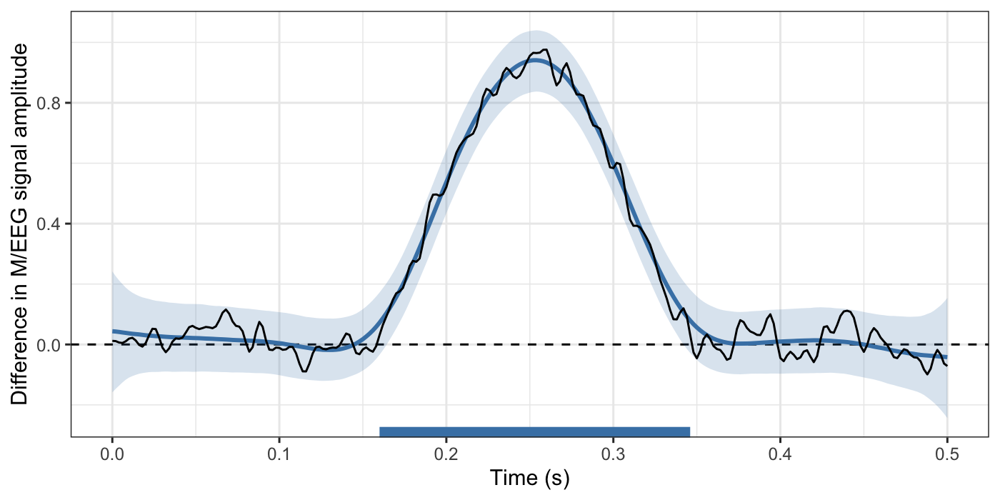

# Precise temporal localisation of time-resolved effects with Bayesian generalised additive multilevel models

The goal of `neurogam` is to provide utilities for estimating the onset
and offset of time-resolved effects, such as those found in M/EEG,
pupillometry, or finger/mouse-tracking data (amongst others). The
current version only allows fitting 1D temporal data (e.g., raw M/EEG
data or decoding timecourses) but will be extended in the near future to
support 2D temporal or spatiotemporal data.

## Installation

You can install the development version of `neurogam` from GitHub with:

``` r
install.packages("remotes")

remotes::install_github(
    repo = "https://github.com/lnalborczyk/neurogam",
    dependencies = TRUE
    )
```

## Usage

Below we fit a Bayesian generalised additive multilevel model (BGAMM) to
estimate the onset and offset of a difference between conditions (in
simulated EEG data).

``` r
# loading the neurogam package
library(neurogam)

# importing some simulated EEG data
data(eeg_data)

# displaying some rows
head(eeg_data)
#>      participant condition trial  time       eeg
#> 1 participant_01     cond1     1 0.000 0.8618045
#> 2 participant_01     cond1     1 0.002 1.2729148
#> 3 participant_01     cond1     1 0.004 1.6538158
#> 4 participant_01     cond1     1 0.006 1.3910888
#> 5 participant_01     cond1     1 0.008 0.6499553
#> 6 participant_01     cond1     1 0.010 0.1548358
```

``` r
# fitting the BGAMM to identify clusters
results <- testing_through_time(
    data = eeg_data,
    predictor_id = "condition",
    threshold = 10
    )
```

``` r
# displaying the identified clusters
print(results$clusters)
#>   cluster_id cluster_onset cluster_offset
#> 1          1         0.172          0.348
```

``` r
# plotting the identified clusters superimposed with the data and GAM-smoothed data
plot(results)
```


