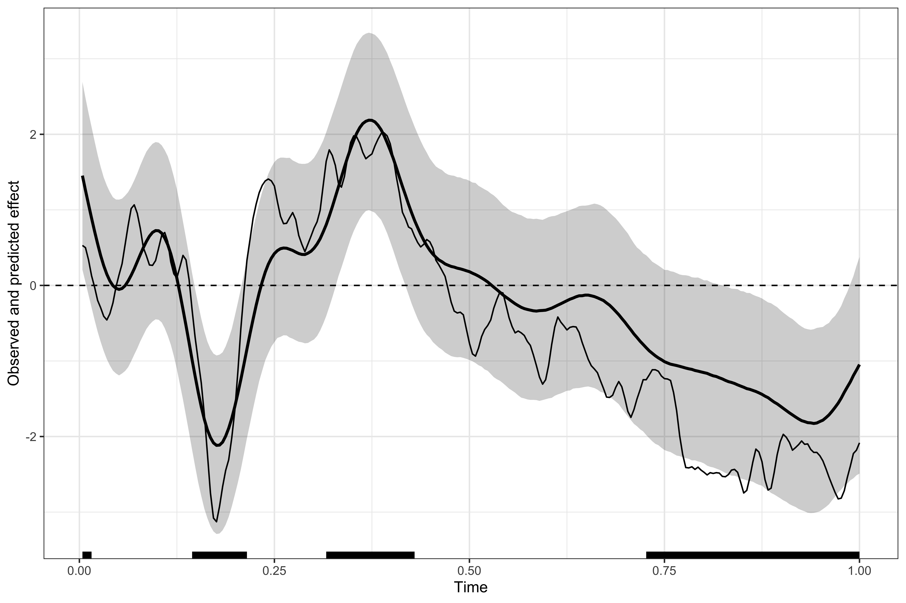
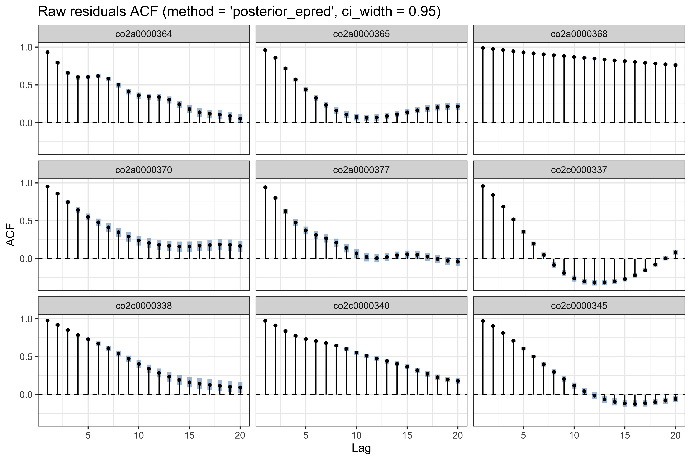
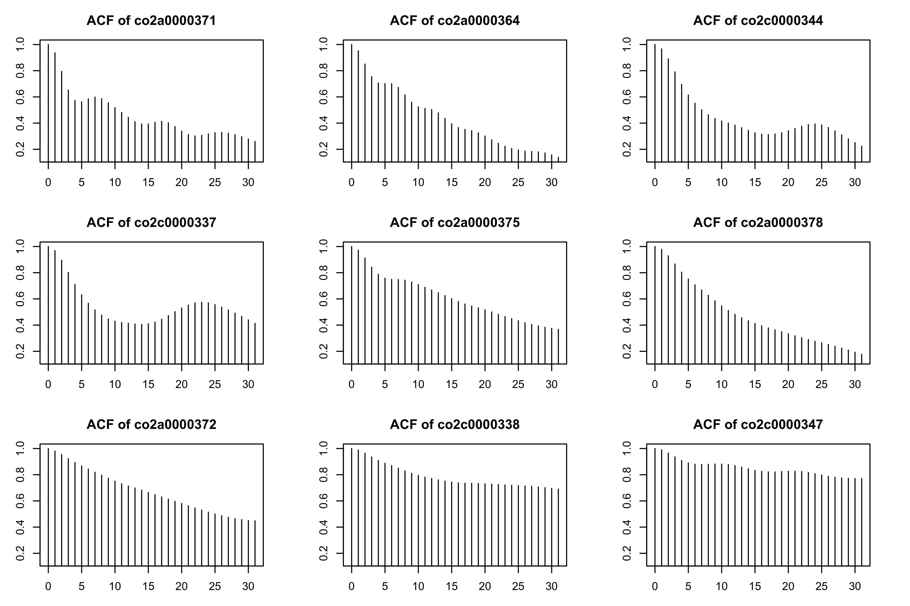
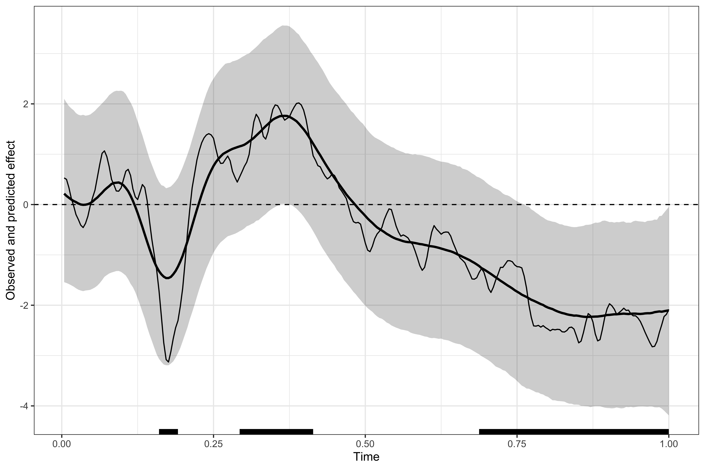
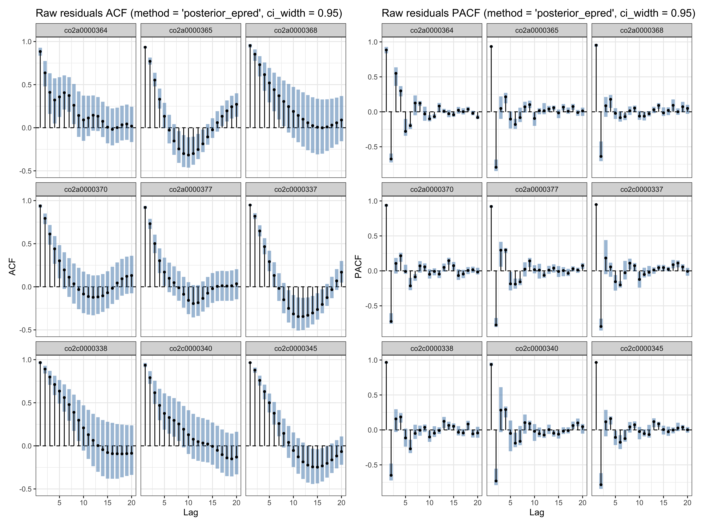
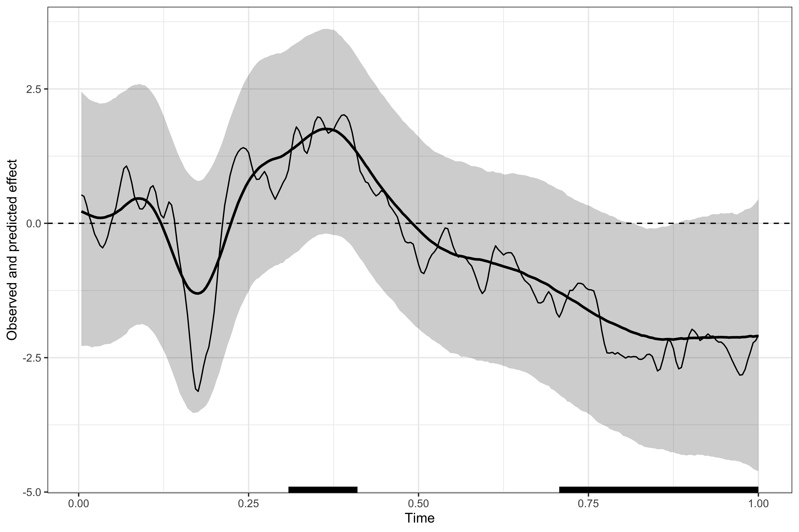

# Checking and modelling residual auto-correlation (1D temporal data)

## Importing and visualising EEG data

Below we import and reshape EEG data from the [`eegkit`
package](https://cran.r-project.org/web/packages/eegkit/index.html).

``` r
library(patchwork)
library(neurogam)
library(ggplot2)
library(eegkit)
library(dplyr)

# retrieving some EEG data
data(eegdata)
head(eegdata)
#>       subject group condition trial channel time voltage
#> 1 co2a0000364     a        S1     0     FP1    0  -8.921
#> 2 co2a0000364     a        S1     0     FP1    1  -8.433
#> 3 co2a0000364     a        S1     0     FP1    2  -2.574
#> 4 co2a0000364     a        S1     0     FP1    3   5.239
#> 5 co2a0000364     a        S1     0     FP1    4  11.587
#> 6 co2a0000364     a        S1     0     FP1    5  14.028

# plotting the average ERP per group and channel
eegdata |>
    summarise(voltage = mean(voltage), .by = c(group, channel, time) ) |>
    ggplot(aes(x = time, y = voltage, colour = group) ) +
    geom_line() +
    facet_wrap(~channel) +
    theme_bw()
```


``` r
# reshape the data
eeg_data <- eegdata |>
    # keeping only one channel
    dplyr::filter(channel == "PZ") |>
    # converting timesteps to seconds
    mutate(time = (time + 1) / 256) |>
    # rounding numeric variables
    mutate(across(where(is.numeric), ~ round(.x, 4) ) ) |>
    # removing NAs
    na.omit()

# show a few rows
head(eeg_data)
#>       subject group condition trial channel   time voltage
#> 1 co2a0000364     a        S1     0      PZ 0.0039  -2.797
#> 2 co2a0000364     a        S1     0      PZ 0.0078  -4.262
#> 3 co2a0000364     a        S1     0      PZ 0.0117  -4.262
#> 4 co2a0000364     a        S1     0      PZ 0.0156  -2.797
#> 5 co2a0000364     a        S1     0      PZ 0.0195  -0.844
#> 6 co2a0000364     a        S1     0      PZ 0.0234   0.132
```

## Fitting a first model

We fit the model (a BGAMM) on one channel (PZ) to test for group
difference at every timestep.

``` r
# fitting the BGAMM to identify clusters
results1 <- testing_through_time(
    # EEG data
    data = eeg_data,
    # participant column
    participant_id = "subject",
    # EEG column
    outcome_id = "voltage",
    # no predictor
    predictor_id = NA,
    # basis dimension
    kvalue = 20,
    # we recommend fitting the GAMM on summary statistics (mean and SD)
    multilevel = "summary",
    # no by-participant varying smooth (for speed purposes)
    varying_smooth = FALSE,
    # threshold on posterior odds
    threshold = 10,
    # number of MCMCs
    chains = 4,
    # number of parallel cores
    cores = 4,
    # number of warmup iterations
    warmup = 1000,
    # total number of iterations (per chain)
    iter = 2000
    )
```

### Visualising the results

``` r
# displaying the identified clusters
print(results1)
#> 
#> ==== Time-resolved GAM results ================================
#> 
#> Clusters found: 4
#> 
#>      sign id onset offset duration
#>  positive  1 0.004  0.016    0.012
#>  positive  2 0.316  0.430    0.114
#>  negative  1 0.144  0.215    0.071
#>  negative  2 0.727  1.000    0.273
#> 
#> =================================================================
```

``` r
# plotting the data, model's predictions, and clusters
plot(results1)
```



### Checking auto-correlation

Below we use the
[`check_residual_autocorrelation()`](https://lnalborczyk.github.io/neurogam/reference/check_residual_autocorrelation.md)
function to check to residual auto-correlation. The ACF plot (per
participant) reveals strong residual auto-correlation.

``` r
# checking residual auto-correlation
ar_check1 <- check_residual_autocorrelation(
    fit = results1$model
    )

# residual ACF (for some participants)
ar_check1$plots$acf_raw
```



Compare with the residuals of the equivalent `mgcv` model (see also
[this
vignette](https://cran.r-project.org/web/packages/itsadug/vignettes/acf.html)).

``` r
library(itsadug)
library(mgcv)

# fitting an equivalent mgcv model
m1 <- bam(voltage ~ s(time, k = 20) + s(subject, bs = "re"), data = eeg_data)

# plotting the raw residuals for some participants
acf_resid(model = m1, split_pred = "subject", n = 9)
#> Quantiles to be plotted:
#>        0%     12.5%       25%     37.5%       50%     62.5%       75%     87.5% 
#> 0.9369281 0.9544371 0.9663653 0.9684141 0.9711032 0.9778108 0.9819698 0.9875842 
#>      100% 
#> 0.9893055
```



## Modelling auto-correlation

The
[`testing_through_time()`](https://lnalborczyk.github.io/neurogam/reference/testing_through_time.md)
function allows including a latent AR1 model to capture unmodelled
autocorrelation (via `include_ar_term = TRUE`), which is estimated
simultaneously to the other model parameters. This contrast with
conventional approaches using a 2-step procedure consisting in first
estimating the residual auto-correlation (from a first model), and then
including this correlation as a fixed parameter in a subsequent model.
Our approach, while more computationally intense, has several
advantages:

- **Proper uncertainty propagation.** Estimating the latent AR term
  jointly with the smooth/linear effects propagates uncertainty about
  autocorrelation into *all* model parameters and predictions. In
  contrast, a 2-step “estimate then fix it” approach is a plug-in
  procedure that conditions on an uncertain quantity, which may yield
  **overconfident** intervals (too-small SEs / under-coverage).

- **Less bias from mean-correlation confounding.** Residual
  autocorrelation depends on what the mean model has already explained
  (and on smoothing penalties). When estimating autocorrelation from
  residuals of an initial fit, we risk **misallocating structure**
  between the smooth trend and the AR process. Joint estimation helps
  the model decide, probabilistically, whether variation is better
  explained by the smooth component or by autocorrelated deviations.

- **Cleaner, less error-prone prediction.** Two-step workflows often
  require awkward post-hoc steps (fit trend, extract residuals, fit AR
  model, forecast residuals, back-transform, etc.), which is tedious and
  easy to get wrong. A joint latent AR formulation gives a single
  coherent generative model for estimation *and* prediction (see also
  [this
  blogpost](https://ecogambler.netlify.app/blog/autocorrelated-gams/)).

``` r
# fitting the BGAMM to identify clusters
results2 <- testing_through_time(
    # EEG data
    data = eeg_data,
    # participant column
    participant_id = "subject",
    # EEG column
    outcome_id = "voltage",
    # no predictor
    predictor_id = NA,
    # basis dimension
    kvalue = 20,
    # we recommend fitting the GAMM on summary statistics (mean and SD)
    multilevel = "summary",
    # no by-participant varying smooth (for speed purposes)
    varying_smooth = FALSE,
    # including (estimating) auto-correlation within the same model
    include_ar_term = TRUE,
    # threshold on posterior odds
    threshold = 10,
    # number of MCMCs
    chains = 4,
    # number of parallel cores
    cores = 4,
    # number of warmup iterations
    warmup = 1000,
    # total number of iterations (per chain)
    iter = 2000
    )
```

``` r
# checking residual auto-correlation
ar_check2 <- check_residual_autocorrelation(fit = results2$model)

# checking auto-correlation estimates
ar_check2$ar_summary
#>   parameter     mean          sd      q025      q50     q975
#> 1     ar[1] 0.992964 0.002707108 0.9862315 0.993497 0.996675
```

If the AR term correctly captured residual auto-correlation, we expect
the average lag-1 auto-correlation to be lower in the corrected
residuals than in the raw residuals.

``` r
head(x = ar_check2$rho1_by_series_raw)
#> # A tibble: 6 × 3
#>   .series     n_time  rho1
#>   <fct>        <int> <dbl>
#> 1 co2a0000364    256 0.944
#> 2 co2a0000365    256 0.961
#> 3 co2a0000368    256 0.997
#> 4 co2a0000369    256 0.962
#> 5 co2a0000370    256 0.969
#> 6 co2a0000371    256 0.970
head(x = ar_check2$rho1_by_series_corrected)
#> # A tibble: 6 × 3
#>   .series     n_time  rho1
#>   <fct>        <int> <dbl>
#> 1 co2a0000364    256 0.608
#> 2 co2a0000365    256 0.803
#> 3 co2a0000368    256 0.688
#> 4 co2a0000369    256 0.831
#> 5 co2a0000370    256 0.708
#> 6 co2a0000371    256 0.669

# average lag-1 autocorrelation across series
mean(x = ar_check2$rho1_by_series_raw$rho1, na.rm = TRUE)
#> [1] 0.9705104
mean(x = ar_check2$rho1_by_series_corrected$rho1, na.rm = TRUE)
#> [1] 0.7431609
```

We then visualise the identified clusters, showing that this model
produces much more conservative estimates (because of the larger
uncertainty about group-level estimates.)

``` r
# displaying the identified clusters
print(results2)
#> 
#> ==== Time-resolved GAM results ================================
#> 
#> Clusters found: 3
#> 
#>      sign id onset offset duration
#>  positive  1 0.293  0.414    0.121
#>  negative  1 0.160  0.191    0.031
#>  negative  2 0.688  1.000    0.312
#> 
#> =================================================================
```

``` r
# plotting the data, model's predictions, and clusters
plot(results2)
```



We visualise both the auto-correlation (ACF) and partial
auto-correlation (pACF) of the raw and AR-corrected (whitened)
residuals.

``` r
(ar_check2$plots$acf_raw + ar_check2$plots$pacf_raw) /
    (ar_check2$plots$acf_corrected + ar_check2$plots$pacf_corrected)
```


## Model comparison

Model comparison suggests that the second model has much better
out-of-sample predictive accuracy (lower WAIC).

``` r
# model comparison using WAIC
brms::waic(results1$model, results2$model)
#> Output of model 'results1$model':
#> 
#> Computed from 4000 by 5120 log-likelihood matrix.
#> 
#>           Estimate   SE
#> elpd_waic -13778.9 44.0
#> p_waic        39.8  4.1
#> waic       27557.8 88.0
#> 
#> 12 (0.2%) p_waic estimates greater than 0.4. We recommend trying loo instead. 
#> 
#> Output of model 'results2$model':
#> 
#> Computed from 4000 by 5120 log-likelihood matrix.
#> 
#>           Estimate   SE
#> elpd_waic -12923.9 38.1
#> p_waic         1.1  0.1
#> waic       25847.9 76.1
#> 
#> Model comparisons:
#>                elpd_diff se_diff
#> results2$model    0.0       0.0 
#> results1$model -855.0      33.0
```

## Lowering auto-correlation with varying smooth

Another way of reducing residual auto-correlation is to improve the
model fit to capture finer structure present in the data. Below we show
that auto-correlation can be considerably lowered by including
per-participant varying smoothers.

``` r
# fitting the BGAMM to identify clusters
results3 <- testing_through_time(
    # EEG data
    data = eeg_data,
    # participant column
    participant_id = "subject",
    # EEG column
    outcome_id = "voltage",
    # no predictor
    predictor_id = NA,
    # basis dimension
    kvalue = 20,
    # we recommend fitting the GAMM on summary statistics (mean and SD)
    multilevel = "summary",
    # no by-participant varying smooth (for speed purposes)
    varying_smooth = TRUE,
    # threshold on posterior odds
    threshold = 10,
    # number of MCMCs
    chains = 4,
    # number of parallel cores
    cores = 4,
    # number of warmup iterations
    warmup = 1000,
    # total number of iterations (per chain)
    iter = 2000
    )
```

``` r
# checking residual auto-correlation
ar_check3 <- check_residual_autocorrelation(fit = results3$model)

# residual ACF and pACF (for some participants)
ar_check3$plots$acf_raw + ar_check3$plots$pacf_raw
```



``` r
# displaying the identified clusters
print(results3)
#> 
#> ==== Time-resolved GAM results ================================
#> 
#> Clusters found: 2
#> 
#>      sign id onset offset duration
#>  positive  1 0.309   0.41    0.101
#>  negative  1 0.707   1.00    0.293
#> 
#> =================================================================
```

``` r
# plotting the data, model's predictions, and clusters
plot(results3)
```



## Model comparison

Model comparison suggests that this last model has slightly better
out-of-sample predictive accuracy (lower WAIC).

``` r
# model comparison using WAIC
brms::waic(results1$model, results2$model, results3$model)
#> Output of model 'results1$model':
#> 
#> Computed from 4000 by 5120 log-likelihood matrix.
#> 
#>           Estimate   SE
#> elpd_waic -13778.3 44.0
#> p_waic        39.2  4.0
#> waic       27556.7 88.0
#> 
#> 12 (0.2%) p_waic estimates greater than 0.4. We recommend trying loo instead. 
#> 
#> Output of model 'results2$model':
#> 
#> Computed from 4000 by 5120 log-likelihood matrix.
#> 
#>           Estimate   SE
#> elpd_waic -12923.9 38.1
#> p_waic         1.1  0.1
#> waic       25847.8 76.1
#> 
#> Output of model 'results3$model':
#> 
#> Computed from 4000 by 5120 log-likelihood matrix.
#> 
#>           Estimate   SE
#> elpd_waic -12919.2 38.4
#> p_waic        37.6  1.9
#> waic       25838.5 76.7
#> 
#> 4 (0.1%) p_waic estimates greater than 0.4. We recommend trying loo instead. 
#> 
#> Model comparisons:
#>                elpd_diff se_diff
#> results3$model    0.0       0.0 
#> results2$model   -4.7       2.2 
#> results1$model -859.1      33.1
```
