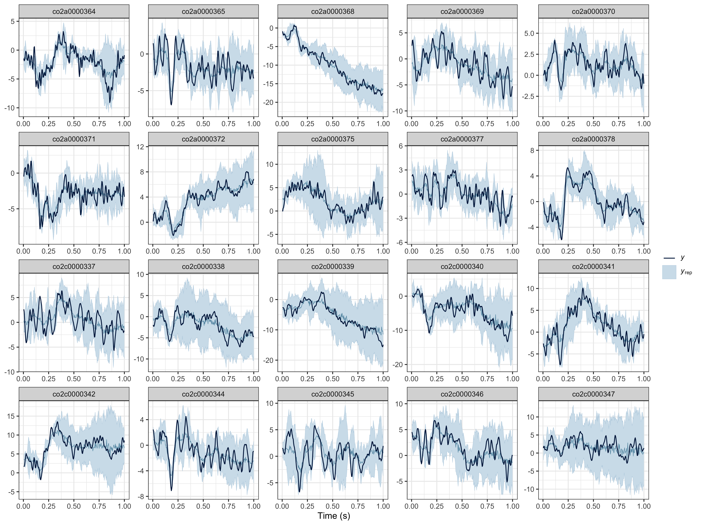

# Application to 1D temporal EEG data

## Importing and visualising EEG data

Below we import and reshape EEG data from the [`eegkit`
package](https://cran.r-project.org/web/packages/eegkit/index.html).

``` r
library(neurogam)
library(ggplot2)
library(eegkit)
library(dplyr)

# retrieving some EEG data
data(eegdata)
head(eegdata)
#>       subject group condition trial channel time voltage
#> 1 co2a0000364     a        S1     0     FP1    0  -8.921
#> 2 co2a0000364     a        S1     0     FP1    1  -8.433
#> 3 co2a0000364     a        S1     0     FP1    2  -2.574
#> 4 co2a0000364     a        S1     0     FP1    3   5.239
#> 5 co2a0000364     a        S1     0     FP1    4  11.587
#> 6 co2a0000364     a        S1     0     FP1    5  14.028

# plotting the average ERP per group and channel
eegdata |>
    summarise(voltage = mean(voltage), .by = c(group, channel, time) ) |>
    ggplot(aes(x = time, y = voltage, colour = group) ) +
    geom_line() +
    facet_wrap(~channel) +
    theme_bw()
```


``` r
# reshape the data
eeg_data <- eegdata |>
    # keeping only one channel
    dplyr::filter(channel == "PZ") |>
    # converting timesteps to seconds
    mutate(time = (time + 1) / 256) |>
    # rounding numeric variables
    mutate(across(is.numeric, ~round(.x, 4) ) ) |>
    # removing NAs
    na.omit()

# show a few rows
head(eeg_data)
#>       subject group condition trial channel   time voltage
#> 1 co2a0000364     a        S1     0      PZ 0.0039  -2.797
#> 2 co2a0000364     a        S1     0      PZ 0.0078  -4.262
#> 3 co2a0000364     a        S1     0      PZ 0.0117  -4.262
#> 4 co2a0000364     a        S1     0      PZ 0.0156  -2.797
#> 5 co2a0000364     a        S1     0      PZ 0.0195  -0.844
#> 6 co2a0000364     a        S1     0      PZ 0.0234   0.132
```

## Fitting the model

``` r
# fitting the BGAMM to identify clusters (around 20-30 min on a recent laptop)
results <- testing_through_time(
    # EEG data
    data = eeg_data,
    # participant column
    participant_id = "subject",
    # EEG column
    outcome_id = "voltage",
    # name of predictor in data
    predictor_id = "group",
    # basis dimension
    kvalue = 30,
    # we recommend fitting the GAMM with summary statistics (mean and SD)
    multilevel = "summary",
    # threshold on posterior odds
    threshold = 10,
    # number of MCMCs
    chains = 4,
    # number of parallel cores
    cores = 4
    )
```

### Visualising the results

``` r
# displaying the identified clusters
print(results)
#> 
#> ==== Time-resolved GAMM results ===============================
#> 
#> Clusters found: 
#> 
#>  cluster_id cluster_onset cluster_offset duration
#>           1          0.27          0.438    0.168
#> 
#> =================================================================
```

``` r
# plotting the data, model's predictions, and clusters
plot(results)
```


Figure 1

### Computing clusters at the participant-level

Below we fit a new model, specifying `predictor_id = NA` (because
`group` varies across participants) and `by_ppt = TRUE` to return
clusters at the participant level.

``` r
# fitting the BGAMM to identify clusters (around 20-30 min on 4 laptop apple M4 cores)
results <- testing_through_time(
    # EEG data
    data = eeg_data,
    # participant column
    participant_id = "subject",
    # EEG column
    outcome_id = "voltage",
    # here we use no predictor (because group varies across participants)
    predictor_id = NA,
    # basis dimension (for both the group and participant levels)
    kvalue = 30,
    # we recommend fitting the GAMM with summary statistics (mean and SD)
    multilevel = "summary",
    # return clusters at both the group and participant levels
    by_ppt = TRUE,
    # threshold on posterior odds
    threshold = 10,
    # number of MCMCs
    chains = 4,
    # number of parallel cores
    cores = 4
    )
```

### Visualising the results

``` r
# displaying the identified clusters
print(results)
#> 
#> ==== Time-resolved GAMM results ===============================
#> 
#> Clusters found: 
#> 
#>  participant cluster_id cluster_onset cluster_offset duration
#>  co2a0000364          1         0.336          0.398    0.062
#>  co2a0000369          1         0.191          0.394    0.203
#>  co2a0000370          1         0.059          0.148    0.089
#>  co2a0000370          2         0.211          0.473    0.262
#>  co2a0000370          3         0.566          0.660    0.094
#>  co2a0000370          4         0.773          0.887    0.114
#>  co2a0000372          1         0.004          0.023    0.019
#>  co2a0000372          2         0.066          0.152    0.086
#>  co2a0000372          3         0.301          1.000    0.699
#>  co2a0000375          1         0.004          0.445    0.441
#>  co2a0000375          2         0.856          0.957    0.101
#>  co2a0000377          1         0.004          0.031    0.027
#>  co2a0000377          2         0.113          0.148    0.035
#>  co2a0000377          3         0.219          0.258    0.039
#>  co2a0000377          4         0.344          0.469    0.125
#>  co2a0000378          1         0.219          0.516    0.297
#>  co2c0000337          1         0.086          0.109    0.023
#>  co2c0000337          2         0.305          0.500    0.195
#>  co2c0000340          1         0.039          0.059    0.020
#>  co2c0000341          1         0.227          0.676    0.449
#>  co2c0000342          1         0.004          0.156    0.152
#>  co2c0000342          2         0.180          1.000    0.820
#>  co2c0000344          1         0.238          0.254    0.016
#>  co2c0000344          2         0.305          0.356    0.051
#>  co2c0000345          1         0.004          0.086    0.082
#>  co2c0000345          2         0.281          0.402    0.121
#>  co2c0000345          3         0.629          0.676    0.047
#>  co2c0000346          1         0.004          0.156    0.152
#>  co2c0000346          2         0.188          0.461    0.273
#>  co2c0000347          1         0.004          0.137    0.133
#>  co2c0000347          2         0.211          0.449    0.238
#> 
#> =================================================================
```

``` r
# plotting the data, model's predictions, and clusters
plot(results)
```


Figure 2

### Posterior predictive checks

We recommend visually assessing the predictions of the model against the
observed data (for each participant). We provide a lightweight
[`ppc()`](https://lnalborczyk.github.io/neurogam/reference/ppc.md)
method, but you can conduct various PPCs with
`brms::pp_check(results$model, ...)` (for all available PPCs, see
<https://mc-stan.org/bayesplot/reference/PPC-overview.html>).

``` r
# posterior predictive checks (PPCs) at the group level
ppc(object = results, ppc_type = "group")
```


Figure 3

``` r
# posterior predictive checks (PPCs) at the participant level
ppc(object = results, ppc_type = "participant")
```



Figure 4
